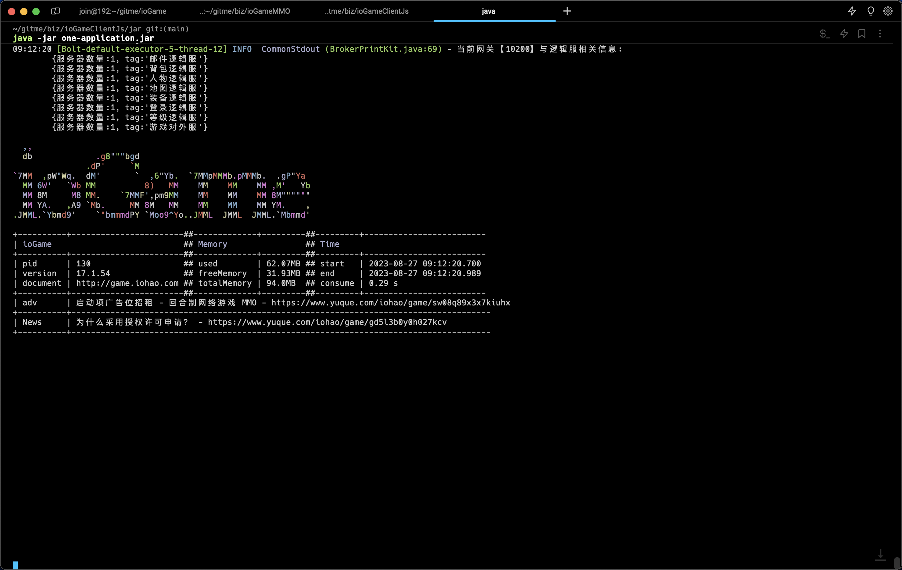
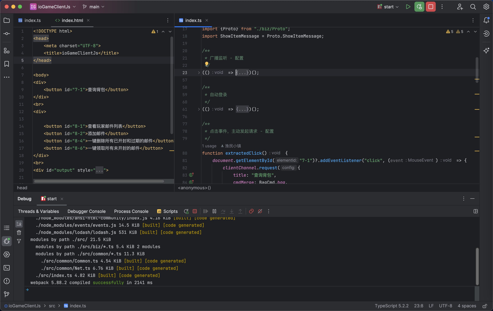
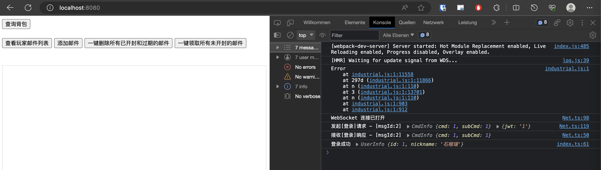
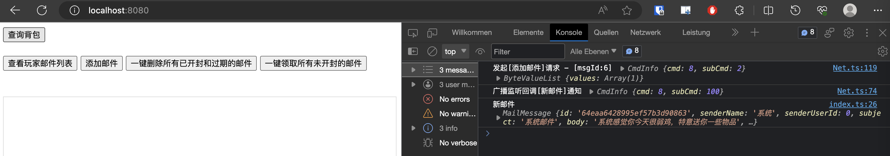
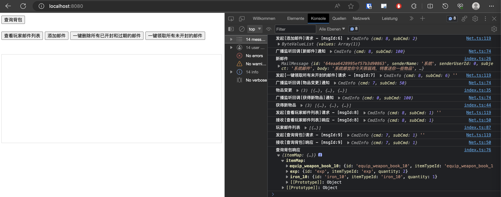

## 源码

| github                                                       | gitee                                                         |
| ------------------------------------------------------------ | ------------------------------------------------------------ |
| [ioGameClientJs](https://github.com/iohao/ioGameClientJs) | [ioGameClientJs](https://gitee.com/iohao/ioGameClientJs) |


## 简介

ioGameMMO 的一个 js 模拟客户端项目，如果你对游戏感兴趣且熟悉 web 前端技术，如 vue ...等，或许可以考虑加入我们，使用 web 前端来联调 ioGameMMO 。


ioGameMMO 介绍：[🔥🔥回合制网络游戏 MMO (yuque.com)](https://www.yuque.com/iohao/game/sw08q89x3x7kiuhx)


## 玩法

### 启动游戏服务器

> java -jar one-application.jar


将 ioGameMMO 打包成 jar 后，启动游戏服务器。使用 jar 而不是使用工具来运行游戏服务器，可以减少内存的占用。




### 运行 ioGameClientJs 项目

#### 1 启动客户端项目


> 初始化项目
>
> npm install
>
> 
>
> 运行项目
>
> npm run start





#### 2 打开页面测试

> http://localhost:8080




#### 3 添加邮件测试




#### 4 其他测试

开发者可以测试点击其他按钮，来触发功能测试




### 示例代码展示

> 与游戏服务器交互，整体来说封装了两种使用方式
>
> 1. 主动请求方式；可以发起请求时，传递请求参数、设置回调函数
> 2. 监听回调方式；主要用于监听服务器的广播，当监听到广播时，会触发回调函数


**主动请求方式**

```ts
    document.getElementById("7-1")?.addEventListener("click", (event) => {
        clientChannel.request({
            title: "查询背包",
            cmdMerge: BagCmd.bag,
            callback: result => {
                let toJson = result.toJson();

                console.log("查询背包响应", toJson)
            }
        });
    });
```


**监听回调方式**

> 监听比较简单，只需要设置需要监听的路由和回调函数

```ts
lientChannel.ofListen({
      title: "新邮件",
      cmdMerge: MailCmd.broadcastNewMail,
      callback: result => {
          let value = result.getValue(new MailMessage());
          console.log("新邮件", value);
      }
  })
```


### 小结

由于之前没写过相关项目，边学边写用了一天的时间；不知道 ts 类型的项目是如何划分项目、文件结构模块的，所以，大家先凑合着看吧。


项目只有两文件 Net.js、Common.ts，如果开发者有 ts 经验的，来帮忙整理和规划一下。


**学习参考资料**

[起步 | webpack 中文文档 | webpack 中文文档 | webpack 中文网 (webpackjs.com)](https://www.webpackjs.com/guides/getting-started/#basic-setup)


[TypeScript 教程 | 菜鸟教程 (runoob.com)](https://www.runoob.com/typescript/ts-tutorial.html)